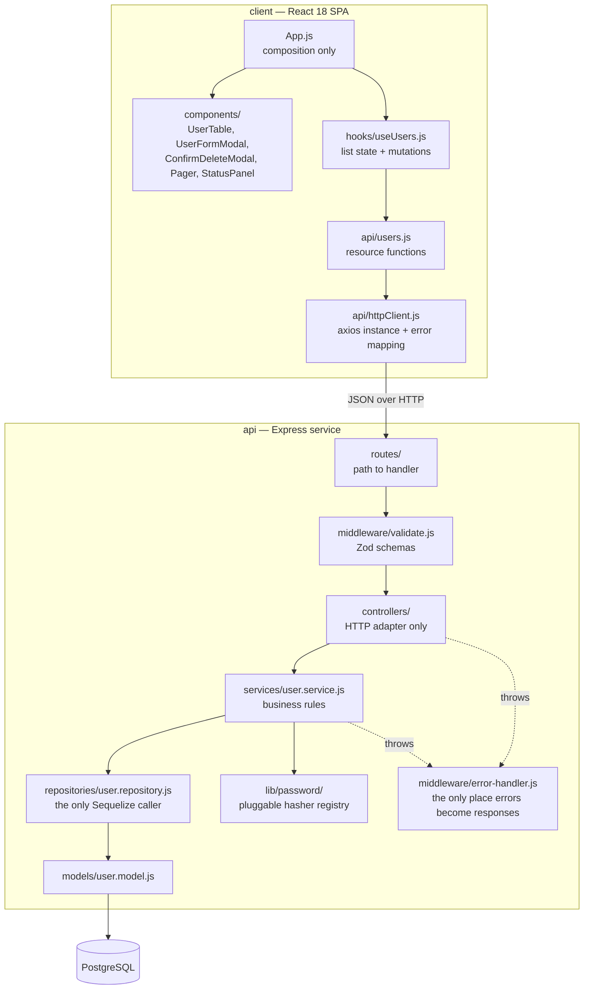
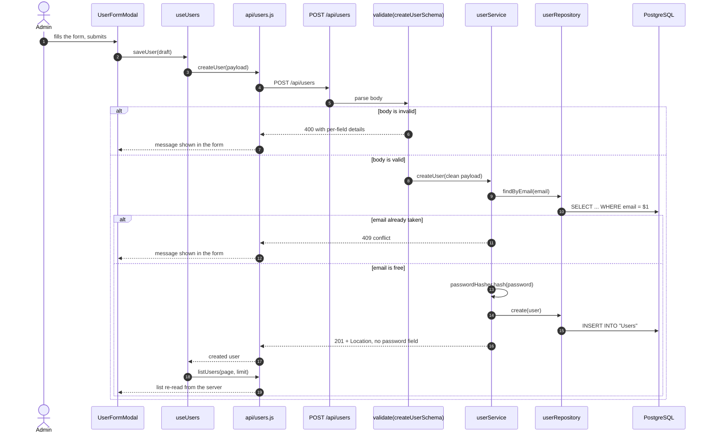

# Fitco user management

A small full-stack CRUD application: an Express + Sequelize REST API over
PostgreSQL, and a React single-page client that lists, creates, edits and
deletes users. It was written as a technical assessment for Fitco, so the scope
is deliberately narrow — one `User` resource, no authentication, no product
features beyond managing that resource.

This repository has since been reworked for correctness, layering, tests and
documentation. The behaviour on offer is the same; what changed is that it is
now layered, validated, paginated, error-handled and covered by 63 tests. The
["What was fixed"](#what-was-fixed) section lists the defects that were found
by exercising the original code.

---

## Screenshots

All four were captured with Playwright at 1440×900 against the running stack —
the API on `http://localhost:8700` backed by PostgreSQL 17.6 and seeded with 34
users, the client on `http://localhost:8701`.

| The user list, server-paginated | Page 3 of 4 |
| --- | --- |
|  |  |

| Editing an existing user | A real 409 surfaced in the form |
| --- | --- |
|  |  |

A literal request/response transcript of every endpoint, captured from the same
running instance, is in [`docs/api-transcript.md`](docs/api-transcript.md).

---

## Architecture

The API is a conventional layered service. Each layer depends only on the one
beneath it, and nothing above the repository layer imports Sequelize.



### Main flow: creating a user



---

## Quickstart

Requires Node 20.11+ and a PostgreSQL instance.

```bash
# 1. API
cd api
npm install
cp .env.sample .env          # set DB_URL; SEED_ON_BOOT=true for demo data
npm start                    # http://localhost:8700

# 2. Client, in a second terminal
cd client
npm install
cp .env.sample .env          # REACT_APP_API_URL=http://localhost:8700
npm start                    # http://localhost:8701
```

Check it is alive:

```bash
curl http://localhost:8700/api/health
# {"status":"ok","database":"up"}
```

### With Docker

```bash
docker compose up --build
# client http://localhost:8701, API http://localhost:8700
```

> The compose file and both Dockerfiles are written and `docker compose config`
> parses cleanly, but **the images have not been built or booted** — the Docker
> daemon was unavailable on the machine this was prepared on. Everything
> described above under "Quickstart" *was* run.

---

## Configuration

### `api/.env`

| Variable | Required | Default | Purpose |
| --- | --- | --- | --- |
| `PORT` | no | `8700` | Port the HTTP server binds to. |
| `CLIENT_URL` | no | `http://localhost:3000` | The single origin allowed by CORS. |
| `DB_DIALECT` | no | `postgres` | `postgres`, or `memory` for the in-process pg-mem engine the test suite uses. |
| `DB_URL` | **yes** when `DB_DIALECT=postgres` | — | Postgres connection string. Boot fails fast if it is missing. |
| `DB_AUTO_SYNC` | no | `true` | Run `sequelize.sync()` at boot. Turn off once real migrations exist. |
| `DB_POOL_MAX` | no | `10` | Maximum pooled connections. |
| `DB_POOL_MIN` | no | `0` | Minimum pooled connections. |
| `PASSWORD_HASHER` | no | `bcrypt` | Which registered hashing strategy to use. |
| `BCRYPT_ROUNDS` | no | `10` | bcrypt cost factor. The test suite uses `4` for speed. |
| `PAGE_DEFAULT_LIMIT` | no | `25` | Page size when the client does not ask for one. |
| `PAGE_MAX_LIMIT` | no | `100` | Hard ceiling on page size; larger requests are rejected. |
| `LOG_LEVEL` | no | `info` (`silent` under `NODE_ENV=test`) | `silent`, `error`, `warn`, `info` or `debug`. `debug` also logs SQL. |
| `SEED_ON_BOOT` | no | `false` | Insert 34 demo users after the schema is synced. Development only. |

### `client/.env`

| Variable | Required | Default | Purpose |
| --- | --- | --- | --- |
| `REACT_APP_API_URL` | no | `/api` (same origin) | Origin of the API, without the `/api` suffix. Inlined at build time by CRA. |
| `PORT` | no | `3000` | Port the CRA dev server binds to. |

---

## Development

```bash
# API
cd api
npm test          # node:test + supertest, against in-process pg-mem
npm run lint      # ESLint
npm run format    # Prettier
npm run seed      # load 34 demo users into DB_URL

# Client
cd client
npm test          # Jest + React Testing Library, axios fully mocked
npm run lint
npm run format
npm run build
```

The suites need no database, no network and no Docker.

Last run, verbatim:

```
$ cd api && npm test
# tests 39
# suites 12
# pass 39
# fail 0

$ cd client && npm test
Test Suites: 3 passed, 3 total
Tests:       24 passed, 24 total
```

---

## Project structure

```
api/
  src/
    config/          env.js (the only reader of process.env), database.js
    routes/          URL → handler wiring, nothing else
    middleware/      validate.js, error-handler.js, not-found.js
    controllers/     HTTP adapters: read request, call service, pick a status
    services/        business rules: hashing, uniqueness, existence
    repositories/    the only module that calls Sequelize
    models/          User definition + the awaited schema bootstrap
    validation/      Zod request schemas
    lib/
      password/      pluggable hasher registry (the extension seam)
      logger.js      level-aware console wrapper
      seed.js        demo roster
    app.js           createApp() — builds Express, binds no port
    server.js        entrypoint: init DB, listen, handle signals
  tests/             39 tests: API integration, hasher, validation
  scripts/seed.js    CLI wrapper around lib/seed.js

client/
  src/
    api/             httpClient.js (axios + error mapping), users.js (resource)
    hooks/           useUsers.js — all list state and mutations
    components/      presentational only; no fetching, no business rules
    App.js           composition
    index.css        design tokens and component styles
  src/__tests__/     24 tests, network mocked with axios-mock-adapter

docs/
  api-transcript.md  literal curl request/response pairs
  capture-api.sh     the script that produced them
  screenshots/       Playwright captures at 1440×900
```

---

## What was fixed

Each of these was reproduced against the original code before being changed,
and each has a regression test. The server-side ones were reproduced by running
the pre-uplift tree against a throwaway database; that session is recorded
verbatim in [`docs/original-behaviour.md`](docs/original-behaviour.md).

| # | Defect | Effect |
| --- | --- | --- |
| 1 | **A live GitHub personal access token was committed** in `api/package.json`'s `repository` field. | Anyone with the repo had push access to the author's GitHub account. Removed; it remains in git history and **must be revoked**. |
| 2 | `PUT /users/:id` did `if (updatedUser)` on the result of `User.update`, which resolves to `[affectedCount]`. `[0]` is truthy. | Updating a user that did not exist returned `200 {"success":true,"message":"User updated successfully"}`. |
| 3 | `DELETE /users/:id` treated `User.destroy` returning `0` as a failure. | Deleting a missing user returned `500 "Couldn't delete user"` instead of `404`. |
| 4 | `POST /users` returned the whole Sequelize instance. | **The bcrypt hash of the new user's password was in the create response body.** |
| 5 | The React modal tracked edit mode in an `isUserUpdating` flag that was never reset on close. | Editing a user, closing, then pressing "Add User" sent `PUT /api/users/undefined` instead of creating anyone. |
| 6 | `baseURL` was built as `` `${process.env.REACT_APP_API_URL}/api` ``. | With no `.env` present, every request went to the literal URL `undefined/api`. |
| 7 | There was no Express error middleware at all, and only one of five controllers had a `try/catch`. | Any rejected promise fell through to Express's default handler: an HTML stack trace with a 500. |
| 8 | No `await` in the client was guarded. | A failed request produced an unhandled rejection and a silently unchanged screen. |
| 9 | `email` had no unique constraint. | Duplicate accounts were accepted silently. |
| 10 | `sequelize.sync()` was called, unawaited, at model-import time. | The server began accepting requests before the table was guaranteed to exist. |
| 11 | `dotenv.config()` ran *after* `process.env.PORT` was read in `app.js`. | Latent: it happened to work only because an imported module called `dotenv.config()` first. Any import reshuffle would have silently reverted the port to 3000. |
| 12 | `GET /users` was an unbounded `findAll`. | The whole table was serialised on every page load. |
| 13 | The edit and delete controls were `<div onClick>` with no label, and the `cursor-pointer` class they referenced was never defined. | Not reachable by keyboard, invisible to screen readers, and no pointer cursor. |
| 14 | `routes/index.js` imported `createRequire` and built a `require` that was never used. | Dead code. |

---

## Design notes

**Layering.** The original had a `dao` module imported under the name
`userService`, and business logic — bcrypt hashing — sat in the controller.
The layers are now real and named: routes wire URLs, validation middleware
parses input, controllers adapt HTTP, services hold rules, repositories hold
SQL. The dependency arrows all point inward. The practical payoff is that
`userService.createUser` is testable without Express and
`userRepository` is the single file to touch if the ORM ever changes.

**Errors are data, not control flow.** Services throw `AppError` and one
middleware turns it into `{ success: false, error: { code, message, details } }`.
Sequelize's `UniqueConstraintError` and body-parser's `entity.parse.failed` are
normalised in that same place. This is why "user not found" is a 404 from every
endpoint rather than a 404 here, a 422 there and a 500 somewhere else.

**Validation at the edge.** Zod schemas parse and *coerce* at the boundary, so
`req.params.id` reaches the service as a number and `email` reaches it trimmed
and lower-cased. Handlers below never re-check shapes. The bcrypt 72-byte input
limit is encoded as a schema rule rather than discovered as a silent truncation.

**The real bottleneck was the unbounded list.** `GET /users` selected every row
on every page load, and the client rendered all of them. It is now paginated
with a server-enforced ceiling (`PAGE_MAX_LIMIT`, default 100) that a client
cannot talk its way past — asking for `limit=100000` is a 400, which
[`docs/api-transcript.md`](docs/api-transcript.md) shows. `email` gained a
unique index, which the uniqueness check also uses, so the pre-insert lookup is
an index probe rather than a sequential scan. Connection pool bounds are
configurable rather than left at defaults. These are the honest wins for a
single-table CRUD service; anything larger would be inventing problems this
application does not have.

**Password hashing is the extension seam.** `lib/password/` is a small registry
of `{ name, hash, verify }` factories selected by `PASSWORD_HASHER`. bcrypt is
the only one registered, but adding argon2id — the current OWASP first choice —
means one new file and one env var, with no change to any service, controller
or test. A test registers a fake hasher to prove the seam is real rather than
decorative.

**Tests run without infrastructure.** The API suite uses `pg-mem`, an
in-process implementation of the Postgres engine, wired in as Sequelize's
`dialectModule`. Tests therefore exercise the same SQL that production does —
`LIMIT`/`OFFSET`, unique constraint violations and affected-row counts all
behave like Postgres — with no server, no container and no native build. The
client suite mocks axios at the adapter level, so the resource functions and
the error-mapping code are genuinely executed; no test makes a network call.

**Why `node:test` and not Jest for the API.** The API is native ESM. Jest's ESM
support still needs experimental VM flags and a Babel step; Node 22's built-in
runner needs neither and ships with the runtime the service already requires.
The client stays on Jest because Create React App owns that configuration.

---

## Limitations

- **There is no authentication or authorisation.** Every endpoint is open. The
  `password` column exists and is correctly hashed, but nothing signs in — there
  is no session, no token, and no login route. This was outside the brief.
- **`sequelize.sync()` is not a migration strategy.** It creates missing tables
  but will not safely alter or drop existing ones. A real deployment needs
  `sequelize-cli` migrations; `DB_AUTO_SYNC=false` is the switch for that.
- **No rate limiting, no request-id, no structured logs.** The logger is a
  level-aware `console` wrapper, which is honest for an assessment and wrong for
  production.
- **bcrypt hashing is synchronous CPU work on the event loop.** At assessment
  scale that is irrelevant; under real signup load it would need a worker
  thread or a queue.
- **The client has no routing and no global state library.** There is one
  screen; adding either would be weight without a reason.
- **`pg-mem` is not PostgreSQL.** It covers this application's SQL faithfully,
  but a suite that grew into window functions, CTEs or extensions would need a
  real database in CI.
- **The Docker images are unbuilt.** See the note under Quickstart.
- **Deleting a user is a hard delete.** There is no soft delete and no audit
  trail.
