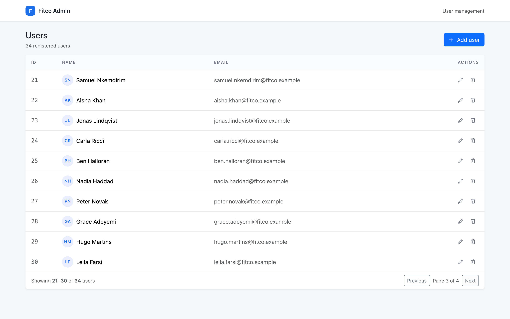
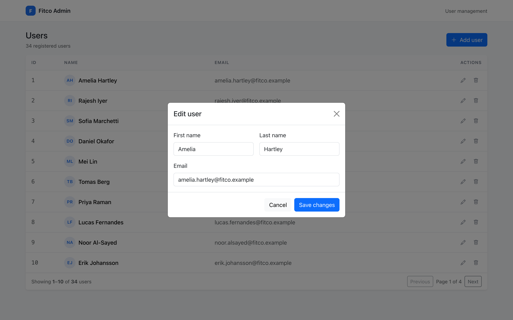
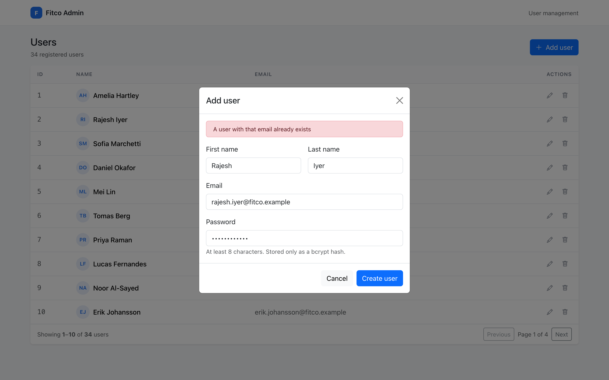
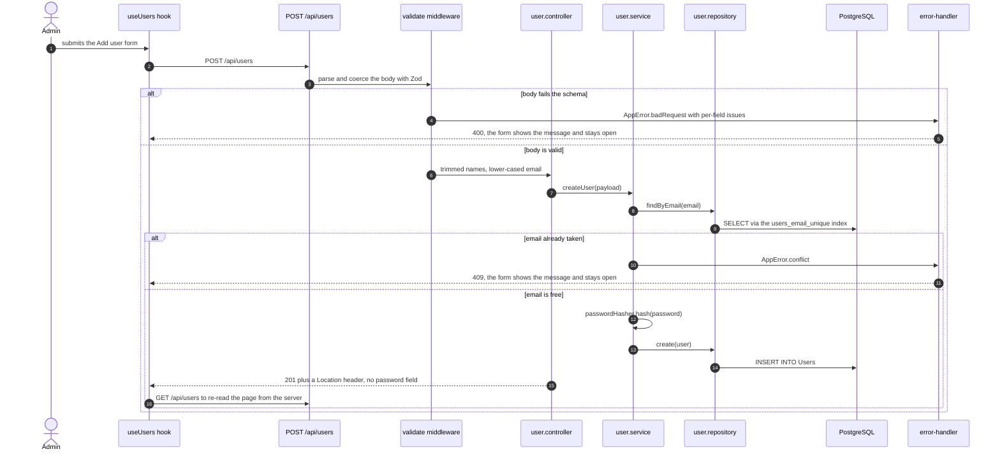

# Fitco user management

A two-package CRUD application built as a technical assessment: an Express +
Sequelize REST API over PostgreSQL, and a React single-page client that lists,
creates, edits and deletes users. The scope is deliberately one `User` resource
— no auth, no second entity, nothing beyond managing that one table.

What makes it worth reading is not the feature list, which is short by design.
It is the layering, the validation boundary, the single error-to-response seam,
and the 63 tests that run without a database, a container or a network.

## Run it

Node 20.11+ and a PostgreSQL instance.

```bash
cd api
npm install
cp .env.sample .env          # set DB_URL; SEED_ON_BOOT=true gives you 34 demo rows
npm start                    # http://localhost:8700

cd ../client                 # second terminal
npm install
cp .env.sample .env          # REACT_APP_API_URL=http://localhost:8700
npm start                    # http://localhost:8701
```

```bash
curl http://localhost:8700/api/health
# {"status":"ok","database":"up"}
```

`/api/health` runs a real `sequelize.authenticate()` and answers `503` with
`{"status":"degraded","database":"down"}` when the database is unreachable.

A compose file and both Dockerfiles are checked in and `docker compose config`
parses cleanly, but **the images have never been built or booted** — the Docker
daemon was unavailable on the machine this was prepared on. Treat
`docker compose up --build` as untested; the npm path above was run.

## What the screens look like

Captured with Playwright against the running stack — the API on port 8700 backed
by a PostgreSQL database seeded with 34 users, the client on port 8701. All four
files are 2880×1800, i.e. 1440×900 at 2× device scale.

| The list, paginated server-side | Page 3 of 4, rows 21–30 |
| --- | --- |
|  |  |

| The edit modal, prefilled, no password field | A genuine 409 surfaced in the form |
| --- | --- |
|  |  |

Literal request/response pairs for every endpoint, captured from that same
instance, are in [`docs/api-transcript.md`](docs/api-transcript.md); the script
that produced them is [`docs/capture-api.sh`](docs/capture-api.sh).

## One request, end to end

Creating a user is the path that touches every layer — validation, a uniqueness
rule, hashing, an insert, and both of the error routes.



## How the code is arranged

Server, with dependencies pointing one way only:

```
routes/          URL to handler, nothing else
middleware/      validate.js (Zod), error-handler.js, not-found.js
controllers/     HTTP adapters: read request, call service, pick a status
services/        business rules: hashing, uniqueness, existence
repositories/    the only module that calls Sequelize
models/          User definition + an awaited schema bootstrap
config/env.js    the only module in the codebase that reads process.env
lib/password/    pluggable hasher registry -- the one extension seam
```

Nothing above `repositories/` imports Sequelize, and `app.js` exports
`createApp()` without binding a port, which is what makes in-process supertest
possible; `server.js` is the entrypoint that awaits the schema, listens, and
handles `SIGINT`/`SIGTERM`.

Client: `api/httpClient.js` (one axios instance, one error-to-string mapper) →
`api/users.js` (resource functions) → `hooks/useUsers.js` (all list state and
mutations) → components, which are purely presentational. `App.js` is
composition only. After every mutation the hook re-reads the page from the
server rather than patching local state, so the UI cannot drift from what the
database normalised.

## Environment variables

`api/.env`:

| Variable | Required | Default | Purpose |
| --- | --- | --- | --- |
| `PORT` | no | `8700` | Port the HTTP server binds to. |
| `CLIENT_URL` | no | `http://localhost:3000` | The single origin allowed by CORS. |
| `DB_DIALECT` | no | `postgres` | `postgres`, or `memory` for the in-process pg-mem engine the tests use. |
| `DB_URL` | **yes** when `DB_DIALECT=postgres` | — | Connection string. Boot throws immediately if it is missing. |
| `DB_AUTO_SYNC` | no | `true` | Run `sequelize.sync()` at boot. Turn off once real migrations exist. |
| `DB_POOL_MAX` / `DB_POOL_MIN` | no | `10` / `0` | Connection pool bounds, rather than Sequelize's defaults. |
| `PASSWORD_HASHER` | no | `bcrypt` | Which registered hashing strategy to resolve. |
| `BCRYPT_ROUNDS` | no | `10` | bcrypt cost factor. The suite uses `4` for speed. |
| `PAGE_DEFAULT_LIMIT` | no | `25` | Page size when the client does not ask for one. |
| `PAGE_MAX_LIMIT` | no | `100` | Ceiling the service clamps every page size to. |
| `LOG_LEVEL` | no | `info` (`silent` under `NODE_ENV=test`) | `silent`, `error`, `warn`, `info` or `debug`. `debug` also logs SQL. |
| `SEED_ON_BOOT` | no | `false` | Insert 34 demo users after the schema syncs. Development only. |

`client/.env`: `REACT_APP_API_URL` (default: a same-origin `/api`, useful behind
a reverse proxy) and `PORT` (CRA's dev server, default `3000`).

## Tests

```bash
cd api    && npm test     # node:test + supertest against in-process pg-mem
cd client && npm test     # Jest + RTL, axios mocked at the adapter
```

Neither suite needs a database, a network or Docker. Last run:

```
$ cd api && npm test
# tests 39
# suites 12
# pass 39
# fail 0

$ cd client && npm test
Test Suites: 3 passed, 3 total
Tests:       24 passed, 24 total
```

The API suite wires `pg-mem` in as Sequelize's `dialectModule`, so tests
exercise the same SQL production does — `LIMIT`/`OFFSET`, unique-constraint
violations, affected-row counts — with no server and no native build. The client
suite mocks axios at the adapter level, so the real resource functions and error
mapping genuinely execute and no test opens a socket.

`npm run lint`, `npm run format:check` and (client) `npm run build` are wired in
both packages.

## Defects found in the original submission

Each row below is either reproduced verbatim in
[`docs/original-behaviour.md`](docs/original-behaviour.md) — a recorded session
of the pre-rework tree running against a throwaway database — or pinned by a
named test in this repository. The history of this repository was rebuilt, so
those two documents, not the commit log, are the evidence.

| Defect | Effect | Pinned by |
| --- | --- | --- |
| `PUT /users/:id` tested `User.update`'s result for truthiness; it resolves to `[affectedCount]`, and `[0]` is truthy | Updating a user that did not exist returned `200 {"success":true}` | `original-behaviour.md` §2; test *returns 404 when updating a user that does not exist* |
| `DELETE /users/:id` treated a `destroy` count of `0` as a server fault | Deleting a missing user returned `500` instead of `404` | `original-behaviour.md` §3; test *returns 404, not 500, when the user does not exist* |
| `POST /users` returned the raw Sequelize instance | **The bcrypt hash was in the create response body** | `original-behaviour.md` §4; test *never returns the password or its hash* |
| No Express error middleware existed, and one of five controllers had a `try/catch` | Any rejected promise fell through to an HTML stack trace containing absolute filesystem paths | `original-behaviour.md` §7; test *returns a JSON 400 for malformed JSON rather than an HTML stack trace* |
| `email` had no unique constraint | Duplicate accounts were accepted silently | `original-behaviour.md` §9; test *rejects a duplicate email with 409* |
| The modal's `isUserUpdating` flag was never reset on close | Edit a user, close, press "Add User", and the form sent `PUT /api/users/undefined` instead of creating anyone | test *returns to create mode after an edit is cancelled* (asserts a POST fires and zero PUTs) |
| `baseURL` was `` `${process.env.REACT_APP_API_URL}/api` `` | With no `.env`, every request went to the literal URL `undefined/api` | test *falls back to a relative /api instead of 'undefined/api'* |
| No `await` in the client was guarded | A failed request produced an unhandled rejection and a visually unchanged screen; a network failure and an empty table looked identical | tests *shows a recoverable error state when the API is unreachable*, *retries the request when Try again is pressed* |
| `GET /users` was an unbounded `findAll` | The whole table was serialised on every page load | test *paginates instead of returning the whole table* |
| Row actions were `<div onClick>` with no label or role, referencing a `cursor-pointer` class that was never defined | Unreachable by keyboard, invisible to screen readers | the controls are now `<button>`s with `aria-label`s, which is the only reason tests can query them by accessible name (`Edit Amelia Hartley`) |
| `sequelize.sync()` ran unawaited at model-import time | The server could accept requests before the table existed | `models/index.js` exports an awaited `initialiseDatabase()`, called before `listen()` in `server.js` |
| `dotenv.config()` ran *after* `process.env.PORT` was read | Latent: it worked only because an imported module happened to load dotenv first | `config/env.js` calls `dotenv.config()` at the top and is the sole reader of `process.env` |
| `routes/index.js` built a `createRequire` that was never used | Dead code | removed |

## Decisions worth explaining

**Errors are data, not control flow.** Services throw `AppError`; one middleware
turns it into `{ success: false, error: { code, message, details } }`.
Sequelize's `UniqueConstraintError`, body-parser's `entity.parse.failed` and
`entity.too.large` are normalised in that same function. That is why "not found"
is a 404 from every endpoint rather than a 404 here and a 500 there.

**Validation sits at the edge and coerces.** Zod schemas parse *and* transform,
so `req.params.id` reaches the service as a number and `email` reaches it
trimmed and lower-cased. Handlers below never re-check shapes. bcrypt's 72-byte
input limit is encoded as a schema rule rather than discovered as silent
truncation.

**The list was the only real bottleneck.** A single-table CRUD service does not
need a cache or a queue, and none was added. What it did need: `findAndCountAll`
with a `{ page, limit, total, totalPages }` envelope, a pager in the UI, and a
size ceiling a client cannot argue past — `?limit=100000` is a `400`, asserted
in `api/tests/user.api.test.js` (*caps limit at PAGE_MAX_LIMIT so a client
cannot ask for everything*). `email` gained a unique index that the pre-insert
uniqueness check also uses, so that lookup is an index probe rather than a
sequential scan. `express.json({ limit: "100kb" })` bounds the other direction.

**Password hashing is the one extension seam.** `lib/password/` is a registry of
`{ name, hash, verify }` factories selected by `PASSWORD_HASHER`. bcrypt is the
only entry, but argon2id — OWASP's current first choice — would be one new file
and one env var, touching no service, controller or test. It is a real seam, not
a decorative one: a test registers a fake hasher at runtime and asserts it is
used, and the registry throws on an unknown name rather than falling back.

**`node:test` for the API, Jest for the client.** The API is native ESM, and
Jest's ESM path still wants experimental VM flags plus Babel; Node's built-in
runner wants neither. The client stays on Jest because CRA owns that config.

## Known gaps

- **No authentication or authorisation at all.** Every endpoint is open. The
  `password` column is correctly hashed but nothing ever signs in — no session,
  no token, no login route. Adding it would have meant inventing a brief.
- **The page-size ceiling is enforced in two places that can disagree.** The Zod
  schema rejects `limit > 100` outright with a `400`, but that `100` is a
  literal; the service separately clamps to `PAGE_MAX_LIMIT`. Set
  `PAGE_MAX_LIMIT=50` and `?limit=80` is accepted by validation and then
  silently clamped. Only the hardcoded bound produces the 400.
- **`sequelize.sync()` is not a migration strategy.** It creates missing tables
  and will not safely alter or drop existing ones. `DB_AUTO_SYNC=false` is the
  off switch; real `sequelize-cli` migrations were out of scope.
- **`pg-mem` is not PostgreSQL.** It models this application's SQL faithfully
  and enforces the unique constraint under test, but a suite that grew into
  CTEs, window functions or extensions would need a real database in CI.
- **The Docker images are unbuilt.** See the note under "Run it".
- **No rate limiting, no request id, no structured logs.** `lib/logger.js` is a
  level-aware `console` wrapper — fine for an assessment, wrong for production.
- **bcrypt is synchronous CPU work on the event loop.** Irrelevant at this
  scale; under real signup load it wants a worker thread or a queue.
- **Deletes are hard deletes.** No soft delete, no audit trail.
- **The client has one screen, no router and no global state library.** Adding
  either would be weight without a reason.
